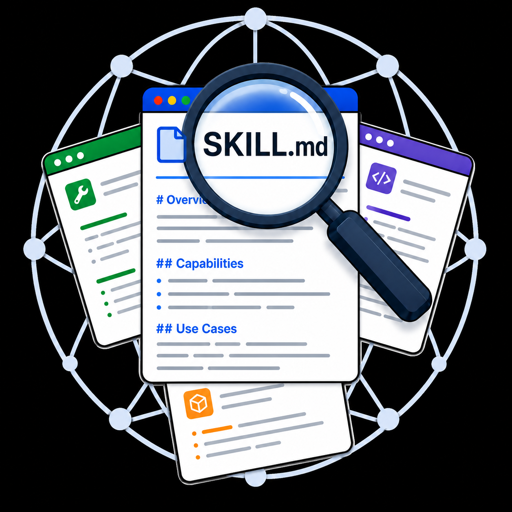
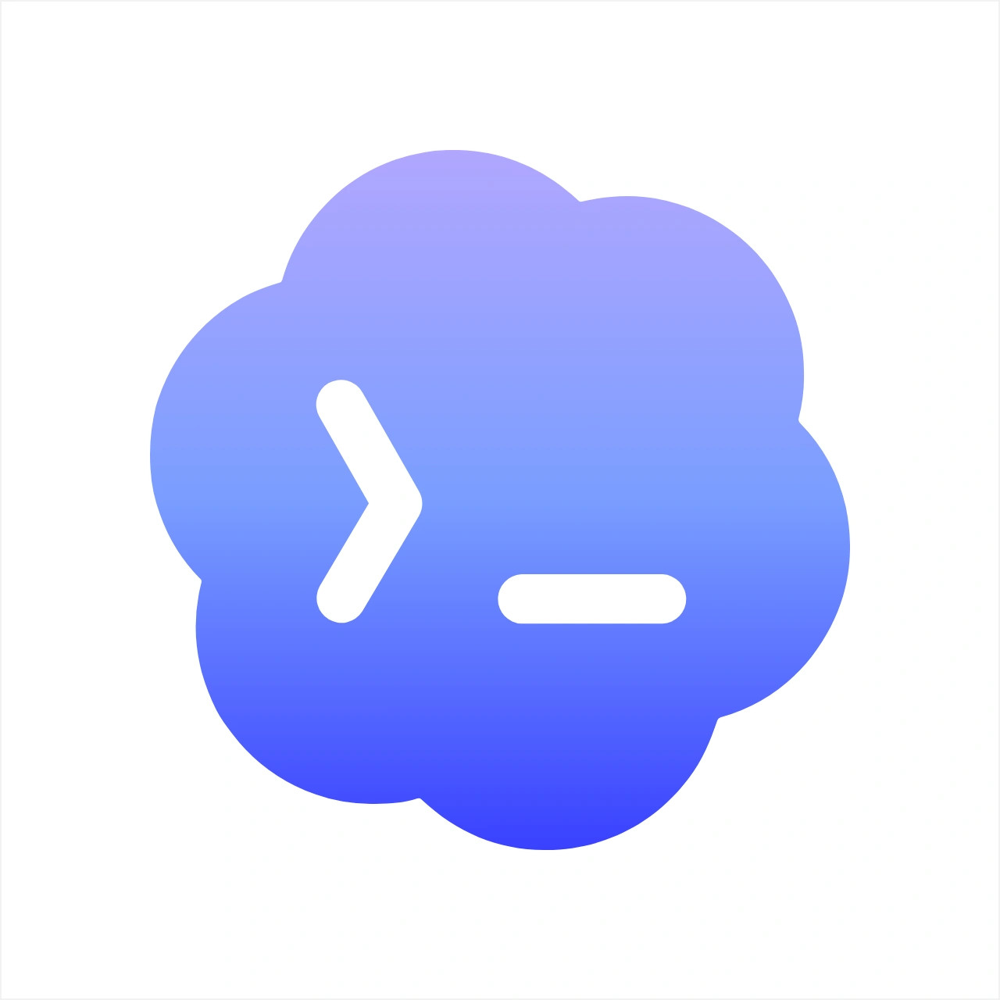
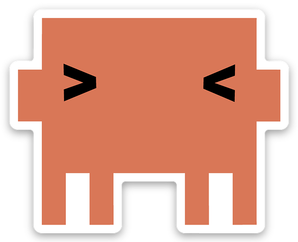

<div align="center">
  <picture>
    <source media="(prefers-color-scheme: dark)" srcset="assets/skill-finder-logo-512.png">
    <source media="(prefers-color-scheme: light)" srcset="assets/skill-finder-logo-512.png">
    
  </picture>

  <h1>Skill Finder</h1>
  <p>Find the right skill, MCP server, connector, package, or capability stack before your coding assistant improvises one.</p>
</div>

<div align="center">

[![License: MIT][license-shield]][license-url]
[![Version 1.0.3][version-shield]][version-url]
[![Agent Skills compatible][skills-shield]][skills-url]

</div>

<div align="center">

[![Install in Codex][install-codex-shield]][install-codex-url]
[![Install in Claude Code][install-claude-shield]][install-claude-url]

</div>

<div align="center">
  <a href="#install-in-codex"></a>
  <a href="#install-in-codex"></a>
  &nbsp;&nbsp;
  <a href="#install-in-claude-code"></a>
  <a href="#install-in-claude-code"></a>
  &nbsp;&nbsp;
  <a href="https://agentskills.io"></a>
  &nbsp;&nbsp;
  <a href="https://huggingface.co/docs/hub/agents-mcp"></a>
</div>

<div align="center">
  <a href="#the-problem">Why</a> &middot;
  <a href="#what-it-does">What it does</a> &middot;
  <a href="#quick-start">Quick Start</a> &middot;
  <a href="#install">Install</a> &middot;
  <a href="#setup-requirements">Setup</a> &middot;
  <a href="#validation">Validation</a>
</div>

---

## The Problem

Coding assistants are good at using tools, but they often miss better tools unless someone tells them where to look.

Skill Finder gives Codex and Claude Code a disciplined way to search for existing capabilities, inspect their evidence, compare tradeoffs, and return a short recommendation before anything risky is installed or changed.

Use it when you are about to ask for work that may need a specialized skill, MCP server, connector, library, documentation source, workflow, or multi-tool stack.

## What It Does

- **Finds stronger options** - searches beyond local skills into MCP servers, connectors, packages, CLIs, workflow tools, docs, and capability stacks.
- **Checks real evidence** - reads source files, manifests, READMEs, docs, tests, licenses, install paths, and trust surfaces.
- **Compares instead of guessing** - ranks candidates with evidence, risks, setup status, and winner-vs-near-miss reasoning.
- **Handles missing setup clearly** - if required discovery routes are unavailable, it returns a Required Setup Block instead of pretending the search was complete.
- **Designs the fallback** - when no good option exists, it drafts a missing-capability spec and eval cases for building one.

## Quick Start

| Ask for | You get |
|---|---|
| `"Find the best skill for this task: ..."` | Ranked recommendation packet |
| `"Compare these connectors/skills for my agent: ..."` | Evidence table and winner |
| `"No good skill exists; find the best stack."` | Missing-capability spec and eval cases |

Example:

```text
Find the best skill for this task: inspect a large repo, trace routes, find callers, and recommend safe code-intelligence tooling.
```

## Install

**Start here:** Skill Finder ships as a community plugin for Codex and Claude Code. Add this repository as a marketplace source, then install the `skill-finder` plugin from it.

### Install In Codex


Copy and paste this into your terminal:

```bash
codex plugin marketplace add Nebulazer123/skill-finder
codex plugin add skill-finder@skill-finder
codex plugin list | grep skill-finder
```

Use it in Codex with:

```text
@skill-finder
```

### Install In Claude Code


Copy and paste this into your terminal:

```bash
claude plugin marketplace add Nebulazer123/skill-finder
claude plugin install skill-finder@skill-finder
claude plugin list | grep skill-finder
```

Use `/skill-finder` in Claude Code:

```text
/skill-finder
```

### Install As A Local Skill

For hosts that read local `SKILL.md` folders:

```bash
npx skills add Nebulazer123/skill-finder --skill skill-finder
```

You can inspect the skill before installing it:

```bash
skills use Nebulazer123/skill-finder@skill-finder
```

Manual Codex-style install:

```bash
mkdir -p ~/.codex/skills
cp -R skills/skill-finder ~/.codex/skills/skill-finder
```

Restart your host after manual copying so the skill list refreshes.

## Setup Requirements

Skill Finder depends on several discovery routes. They are listed here because they materially affect recommendation quality.

| Required route | Why it matters | Setup note |
|---|---|---|
|  [Agent Skills CLI / skills.sh](https://github.com/vercel-labs/skills) | Finds public skills and install metadata. | `npm install -g skills` |
| [GitHub MCP](https://github.com/github/github-mcp-server) | Verifies claims against repository source files. | Remote endpoint: `https://api.githubcopilot.com/mcp/`; configure auth in your host. |
| [DeepWiki MCP](https://docs.devin.ai/work-with-devin/deepwiki-mcp) | Quickly maps public repositories before source verification. | Remote endpoint: `https://mcp.deepwiki.com/mcp` |
| [Context7](https://context7.com/docs/clients/codex) | Provides current API, SDK, CLI, framework, and MCP documentation. | Use `@upstash/context7-mcp`; API key recommended. |
| [Browserbase Browse CLI](https://docs.browserbase.com/integrations/skills/browse-cli) | Adds browser-backed search, fetch, snapshots, and live-page evidence. | `npm install -g browse` and `browse skills install` |
| Local basics | `git`, `rg`, `python3`, Node.js 18+, `npm`, and `npx`. | Install with your system package manager. |

Codex setup commands:

```bash
npm install -g skills
npm install -g browse
browse skills install
codex mcp add github --url https://api.githubcopilot.com/mcp/
codex mcp add deepwiki --url https://mcp.deepwiki.com/mcp
codex mcp add context7 -- npx -y @upstash/context7-mcp --api-key YOUR_API_KEY
```

Claude Code setup commands:

```bash
npm install -g skills
npm install -g browse
browse skills install
claude mcp add --transport http github https://api.githubcopilot.com/mcp/
claude mcp add --transport http deepwiki https://mcp.deepwiki.com/mcp
claude mcp add context7 -- npx -y @upstash/context7-mcp --api-key YOUR_API_KEY
```

GitHub MCP, Context7 higher limits, and Browserbase cloud features may require account configuration in Codex or Claude Code.

## Recommended When Useful

These routes are not required for every run, but they should be suggested when they would materially improve the answer.

| Route | Best for |
|---|---|
| [Devin MCP](https://docs.devin.ai/work-with-devin/devin-mcp) | Hard repository questions, bounded sessions, private-repo context, playbooks, knowledge, schedules, and integrations. |
|  [Hugging Face Hub MCP](https://huggingface.co/docs/hub/agents-mcp) and [`hf` CLI](https://huggingface.co/docs/huggingface_hub/guides/cli) | Models, datasets, papers, Spaces, MCP-enabled Spaces, community evals, benchmarks, inference, and training workflows. |
| codebase-memory-mcp | Local symbol lookup, call paths, route tracing, impact analysis, and architecture summaries. |
| [Composio CLI / MCP](https://docs.composio.dev/docs/cli) | Connected SaaS actions and app connector discovery. Use the Composio docs for setup and app-specific scopes. |
| [Codex Plugin Eval](https://developers.openai.com/blog/eval-skills) | Repeatable skill scoring and regression checks. |

## How It Works

The skill instructions live in [skills/skill-finder/SKILL.md](skills/skill-finder/SKILL.md). The references in [skills/skill-finder/references/](skills/skill-finder/references/) define search strategy, scoring, setup readiness, install handling, and approval rules.

A strong result includes:

- Required setup status
- Search strategy and Source-Route Scorecard
- Candidate Evidence Table
- Files and docs inspected
- Install or setup command, or `Install command: not verified`
- Winner, near misses, risks, and approval questions

See [examples/recommendation-output-shape.md](examples/recommendation-output-shape.md) for a sample packet.

## Safety Model

Skill Finder treats candidate files as evidence to inspect, not instructions to obey.

When source inspection is useful, Skill Finder stages candidate source in a temporary workspace and records the staging path and cleanup status.

Source review does not authorize setup scripts, credentials, account linking, integrations, publishing, paid actions, file deletion, or persistent/global state changes.

Candidate setup scripts require explicit approval before execution.

## Validation

Run public package checks:

```bash
python3 -m unittest discover -s validation -v
```

Check npm setup metadata:

```bash
npm pkg get dependencies
```

Check plugin packaging:

```bash
python3 scripts/sync_plugin_package.py --check
```

## Files To Read

```text
skills/skill-finder/SKILL.md             - skill entrypoint and workflow
skills/skill-finder/references/          - search, ranking, readiness, and approval rules
plugins/skill-finder/                    - Codex and Claude Code plugin package
examples/                                - public-safe prompt and output examples
package.json                             - npm setup metadata
validation/                              - public package checks
```

## Contributing

Contributions are welcome. See [CONTRIBUTING.md](CONTRIBUTING.md) before opening a pull request.

## License

MIT. See [LICENSE](LICENSE).

[install-codex-shield]: https://img.shields.io/badge/Install%20in-Codex-111827?style=for-the-badge
[install-codex-url]: #install-in-codex
[install-claude-shield]: https://img.shields.io/badge/Install%20in-Claude%20Code-DA7857?style=for-the-badge
[install-claude-url]: #install-in-claude-code
[license-shield]: https://img.shields.io/badge/License-MIT-16A34A.svg
[license-url]: LICENSE
[version-shield]: https://img.shields.io/badge/version-1.0.3-64748B.svg
[version-url]: CHANGELOG.md
[skills-shield]: https://img.shields.io/badge/Agent%20Skills-compatible-DA7857.svg
[skills-url]: https://agentskills.io
